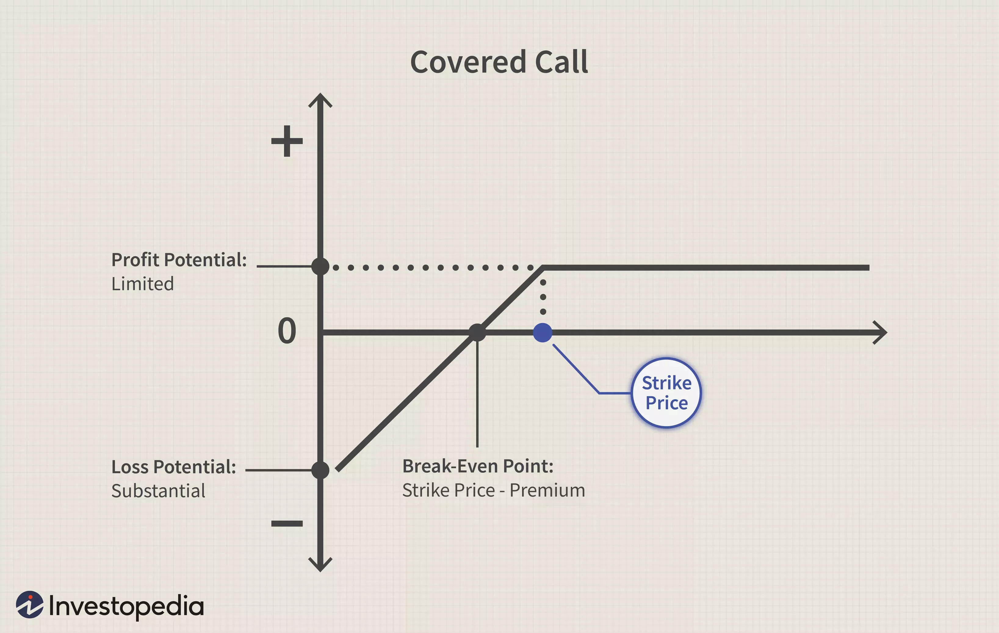

# Replicating Market Maker

#### Primitive Protocol is a series of Replicating Market Makers: AMMs whose portfolio value matches a target payoff.

With the launch of Primitive's first RMM, "RMM-01", any user can provide liquidity to get an liquidity token with a payoff matching a covered call. 

The RMM uses a trading rule between two assets, such that the optimal trade is always re-balancing the liquidity position to match a covered call payoff. This allows swaps between the pair, like any other AMM.

### Portfolios

A portfolio is a composition of multiple assets packaged into a single position. For example, Uniswap protocol liquidity positions (LPs) are a portfolio of two assets with equal weights of 50% . Balancer protocol LPs can have multiple tokens, with different weight denominations (% value of the portfolio).

### Value of Portfolios

The value of an Uniswap LP is dependent on the value of its underlying assets and their performance over time. When the value of one asset with respect to the other asset changes, the portfolio must be rebalanced such that the composition of value is equally 50%/50% in each asset. This reblancing occurs by actors called "arbitrageurs" who put one asset in and take another asset out, as to maintain the pool composition to equal 50%/50% value.

### Rebalancing

When the rebalance occurs, whoever made the trade will have paid a trading fee. This trading fee is earned by all the liquidity providers of the pool. Therefore, as more trades (rebalancing) occurs, their portfolio value will grow over time.

### Replication

Portfolio Replication is when a portfolio _targets a value_, using a composition of multiple assets and arbitrageurs. This targeting should occur in infinitesimal timesteps, where the portfolio value matches the theoretical value it tracks at every point of time.

### Replicating Market Makers

An RMM uses a specialized rule (like the constant product rule that Uniswap uses: xy=k) such that the portfolio is always being rebalanced in a way that it matches a desired payoff. **TL:DR:** Arbitrageurs only make a profit when they get the portfolio close to the desired payoff.

### What payoffs does the Primitive RMM have?

The first payoff, implemented in RMM-01, is a covered call: a portfolio composed of 1 unit of underlying asset (like Ether) at `maturity` if the price of the asset is above a `strike price`, or composed of `strike price` units of the stable asset (like USDC) if the price of the asset is below the `strike price`.

### Why use an RMM?

An RMM can be used to create hedges against other positions, like options or other liquidity positions. The Primitive RMM allows curves to be created with several different parameters, enabling more customized hedges. The caveat: if theres no arbitrageurs, the payoff won't match. For this reason, smaller size hedges would be better off contributing to a large pool. Larger size hedges do have the luxury of creating what they want, as long as the size of the pool is large enough to motivate arbitrageurs.

### Why is portfolio replication used?

Replication is commonly used to construct hedges, to counteract the exposure of other positions. 

### Why use AMMs?

In a compute constrained environment, like Ethereum, high-touch systems like orderbooks become increasingly costly to maintain. AMMs excel in an environment like Ethereum because they imply where orders sit and at what price, through the use of a simple mathematical trading rule.

In addition, AMM positions are instantly convertible into the underlying tokens, there is no custody or credit risk, and they are often used as building blocks in other protocols. Fundamentally, AMMs represent a common standard familiar to users, developers, and DeFi infrastructure, therefore making specialized AMMs a useful lego.

### I'd like to learn more

To learn more about how AMMs and portfolio replication go together, check out the research by Guillermo, Alex, and Tarun:


[research.md](advanced/research.md)


